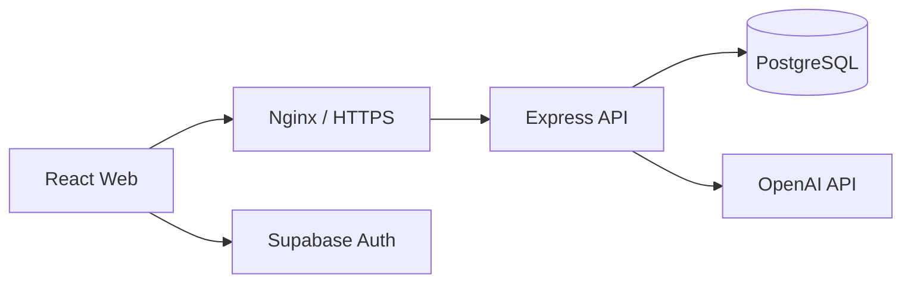

# Campus Mate

> ## 🚀 [지금 Campus Mate 체험하기](https://campusmate.site)
>
> **https://campusmate.site** — 공강이 겹치는 캠퍼스 친구와 점심 약속을 만들어 보세요.

Campus Mate는 시간표와 선호 시간을 바탕으로 같은 캠퍼스의 점심 메이트를 찾아주는 서비스입니다. 자연어로 원하는 날짜와 시간을 말하면 가능한 메이트와 장소를 추천하고, 실제 약속 제안까지 이어줍니다.

> [!IMPORTANT]
> **채팅으로 메이트를 추천받기 전에 `시간표` 탭에서 본인의 `선호 가능한 점심 시간`을 먼저 추가해 주세요.** 가능한 시간이 등록되어 있지 않으면 공통 공강을 계산할 수 없어 추천이 진행되지 않습니다.

## 주요 기능

- 이메일 회원가입과 로그인
- 학교·캠퍼스·관심사를 포함한 프로필 설정
- 수업 시간표와 점심 가능 시간 관리
- 공통 공강 기반 메이트 추천
- 자연어 요청을 이해하는 AI 점심 매칭
- 거리·예산·분위기를 고려한 장소 추천
- 점심 제안 전송과 수락·거절·취소

## 데모 흐름

1. [배포 사이트](https://campusmate.site)에서 회원가입하거나 로그인합니다.
2. 프로필과 시간표, 선호 가능한 점심 시간을 등록합니다.
3. `월요일 12시에 한 시간 점심 먹을 친구 찾아줘`처럼 요청합니다.
4. 추천된 메이트와 장소를 확인하고 점심 제안을 보냅니다.
5. 제안·약속 화면에서 진행 상태를 관리합니다.

## 구성



| 영역 | 기술 |
| --- | --- |
| Frontend | React 19, TypeScript, Vite |
| Backend | Node.js, Express 5, TypeScript, Zod |
| Database | PostgreSQL 17 |
| Auth | Supabase Auth |
| AI | OpenAI API |
| Deployment | Docker Compose, Nginx, Let's Encrypt |

## 로컬 실행

### 준비

- Node.js 22+
- Docker 및 Docker Compose
- Supabase 프로젝트
- OpenAI API 키

```bash
cp .env.example .env
cp backend/.env.example backend/.env
```

두 환경파일에 필요한 값을 입력한 다음 전체 서비스를 실행합니다.

```bash
docker compose up -d --build
```

- Frontend: http://localhost:5173
- Backend health: http://localhost:3000/health
- PostgreSQL: localhost:5432

PostgreSQL 데이터는 `postgres_data` Docker named volume에 저장되어 컨테이너 재생성 후에도 유지됩니다. `docker compose down -v`는 볼륨까지 삭제하므로 주의하세요.

## 개발 명령

```bash
# Backend
npm --prefix backend ci
npm --prefix backend test
npm --prefix backend run typecheck

# Frontend
npm --prefix frontend ci
npm --prefix frontend run typecheck
npm --prefix frontend run build
```

## 환경변수

실제 키와 토큰은 커밋하지 않습니다. 변수 목록과 설명은 아래 예시 파일을 참고하세요.

- [통합 Compose 환경변수](./.env.example)
- [Backend 환경변수](./backend/.env.example)
- [Frontend 환경변수](./frontend/.env.example)

## 문서

- [API 명세](./docs/api/README.md)
- [Backend 안내](./backend/README.md)
- [Backend 개발 문서](./docs/backend/README.md)
- [Frontend 구현 가이드](./docs/FRONTEND_IMPLEMENTATION_GUIDE.md)

## 배포 상태

- Web: [https://campusmate.site](https://campusmate.site)
- API health: [https://api.campusmate.site/health](https://api.campusmate.site/health)
- Frontend, Backend, PostgreSQL을 단일 Docker Compose 스택으로 운영합니다.
